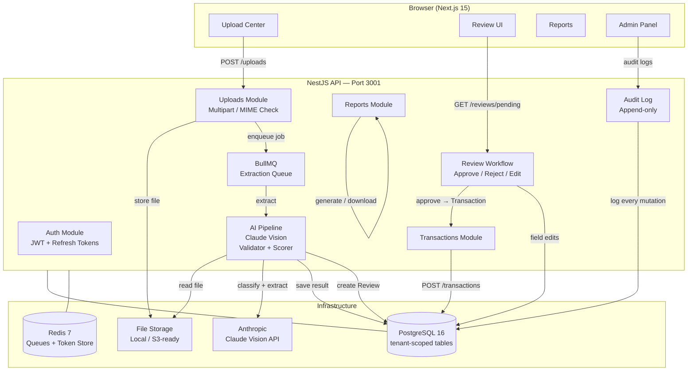
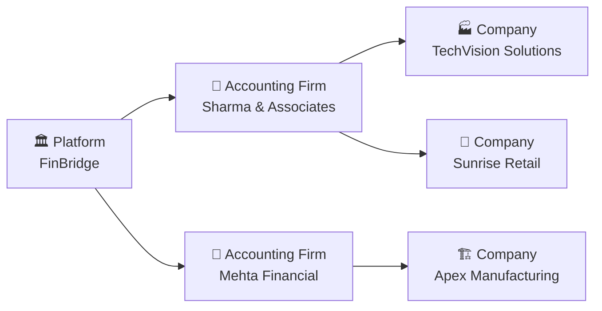
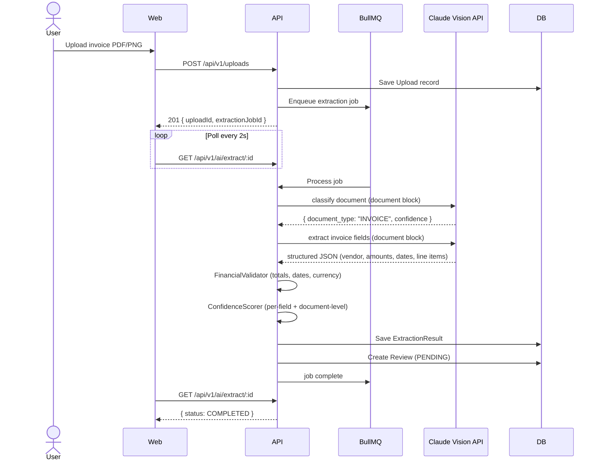

# FinBridge — System Architecture

## High-Level Overview

## Tenant Hierarchy

Every database table carries `tenant_id`. The `TenantContextService` (REQUEST-scoped) extracts the current tenant from the JWT and injects it into all TypeORM queries — tenant data never leaks across boundaries. `PLATFORM_ADMIN` users bypass tenant filters.

## AI Extraction Pipeline

## Tech Stack

| Layer    | Technology                                                                      |
| -------- | ------------------------------------------------------------------------------- |
| Frontend | Next.js 15 (App Router), TypeScript, Tailwind CSS, shadcn/ui, Zustand, Recharts |
| Backend  | NestJS, TypeScript, TypeORM, BullMQ, Anthropic Claude Vision API                |
| Database | PostgreSQL 16 (multi-tenant, shared schema)                                     |
| Queue    | Redis 7 + BullMQ (async extraction, DLQ after 3 retries)                        |
| Monorepo | Turborepo + pnpm workspaces                                                     |
| Infra    | Docker Compose, GitHub Actions CI                                               |
